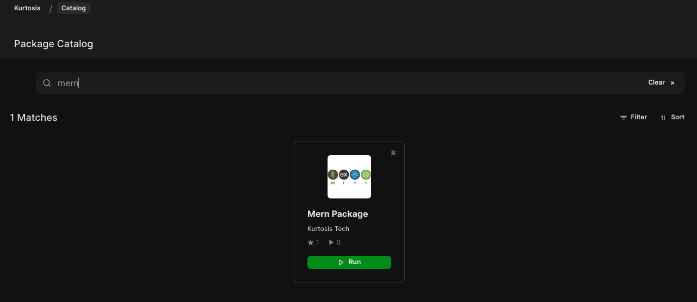
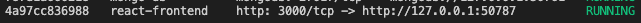

# MERN package

This is a [Kurtosis](https://github.com/kurtosis-tech/kurtosis/) MERN package you can use as a template to create your own MERN project.

## How to run this MERN example package?

### In Kurtosis cloud

You can run this package very easily from the [Kurtosis cloud](https://cloud.kurtosis.com/)

#### Step 1

Login into the [Kurtosis cloud](https://cloud.kurtosis.com/)

#### Step 2

Find the package in the catalog and press the `run` button
<br />

<br />
<br />

This screen record shows the entire run workflow:


### Using the Kurtosis CLI

You can run this package also with the Kurtosis CLI.

#### Step 1

Install [Kurtosis][install-kurtosis]

#### Step 2

Create the package's configuration file to set your custom values to run the package.

Duplicate the `example-config.yml` file and rename it to `config.yml`.

```bash
# in the package's root
cp ./example-config.yml ./config.yml
```

Fill the created `config.yml` file with your custom values.

Make sure to not commit or include this file in the repository history (for serurity reasons dude it contains private credentials), you can check that the `config.yml` was added into the `.gitignore` file.

#### Step 3

Use the `run` command to execute the package:

```bash
kurtosis run github.com/kurtosis-tech/mern-package --args-file config.yml
```

To blow away the created [enclave][enclaves-reference], run `kurtosis clean -a`.

#### Step 4

You can access to the application in the browser by clicking or copying the `react-frontend` address printed at the end of the package execution, in the `Ports` colum inside the `User Services` section
<br />


## How to create your own MERN application based on this package?

### STEP 1

Click ["Use this template"](https://github.com/kurtosis-tech/mern-package/generate) to generate a new repository based on this one.
Then open your terminal and clone your repository:

```bash
# replace YOURUSER and YOURREPO with the correct values
cd ~/Desktop
git clone https://github.com/[YOURUSER]/[YOURREPO].git
```

### STEP 2

#### Create your own backend service

You can edit the Express backend service by editing the files inside the `./backend/files` folder.

#### Create your own frontend service

You can edit the React frontend service by editing the files inside the `./frontend/files` folder.

<!-------------------------------- LINKS ------------------------------->
[install-kurtosis]: https://docs.kurtosis.com/install
[enclaves-reference]: https://docs.kurtosis.com/concepts-reference/enclaves
